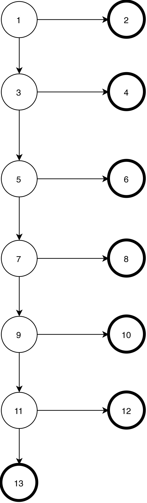
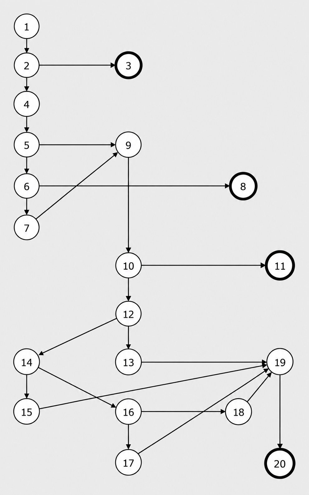
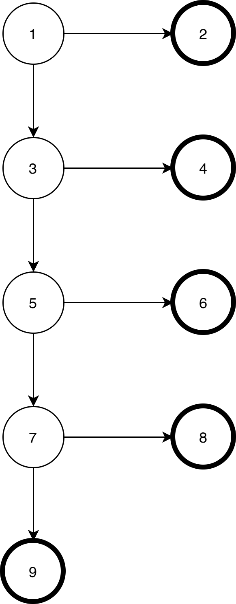
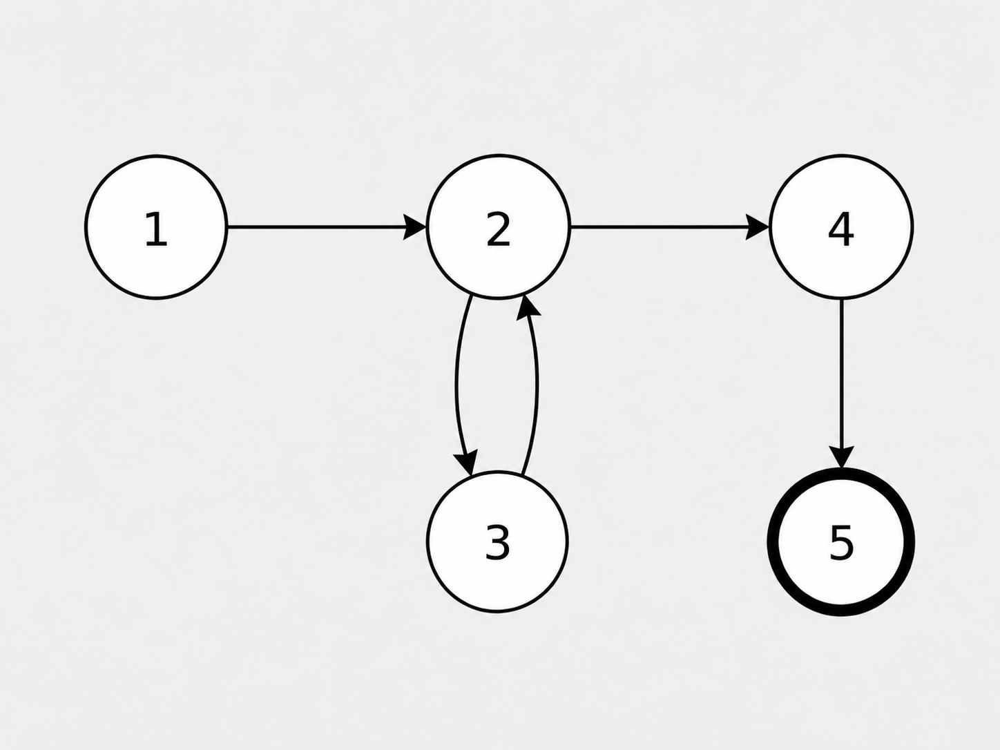
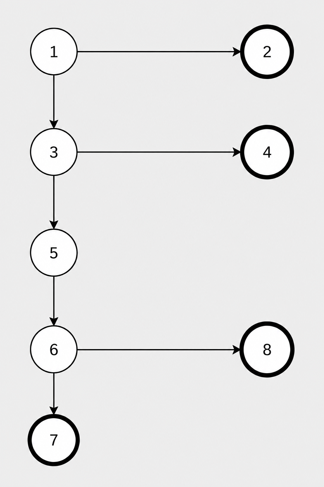
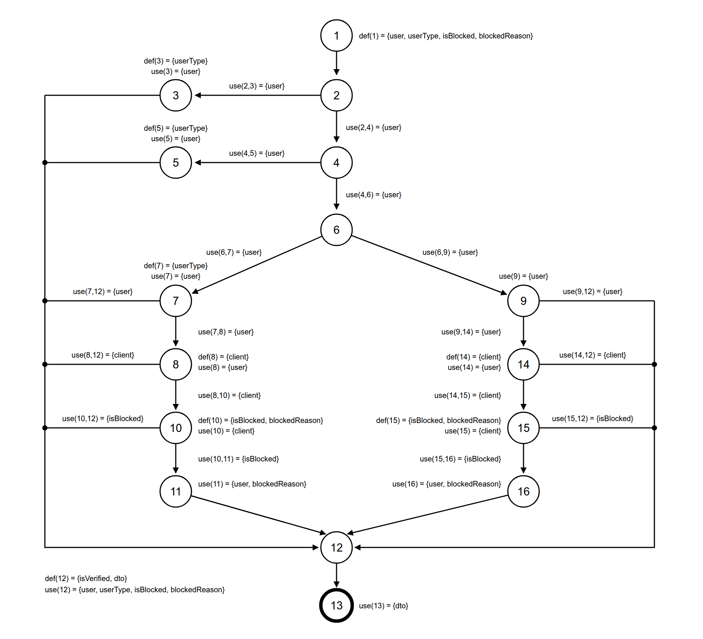

# Graph Coverage

---

## Edge Pair Coverage

### `AppointmentService.cancelAppointmentForOwner(Long userId, Long appointmentId)`

**Graph:**

  

**Nodes:**
1. `if (userId == null || appointmentId == null)`
2. `throw new RuntimeException("User and appointment are required");`
3. `if (appointment == null)`
4. `throw new RuntimeException("Appointment not found");`
5. `if (appointment.getResponsibleOwner() == null || ... || !appointment.getResponsibleOwner().getUserId().equals(userId))`
6. `throw new RuntimeException("You can only cancel your own appointments");`
7. `if (!appointment.getDateTime().isAfter(LocalDateTime.now()))`
8. `throw new RuntimeException("Only future appointments can be cancelled");`
9. `if ("CANCELLED".equals(appointment.getStatus()) || "CANCELED".equals(appointment.getStatus()))`
10. `throw new RuntimeException("Appointment is already cancelled");`
11. `if ("DONE".equals(appointment.getStatus()) || "NO_SHOW".equals(appointment.getStatus()))`
12. `throw new RuntimeException("This appointment can no longer be cancelled");`
13. `appointment.setStatus("CANCELLED"); appointmentRepository.save(appointment); notifyClinicAboutCancellation(saved); return mapToOwnerDTO(saved);`

**Edges:**
(1,2), (1,3), (3,4), (3,5), (5,6), (5,7), (7,8), (7,9), (9,10), (9,11), (11,12), (11,13)

**All Edge Pairs:**
[1, 3, 4], [1, 3, 5], [3, 5, 6], [3, 5, 7], [5, 7, 8], [5, 7, 9], [7, 9, 10], [7, 9, 11], [9, 11, 12], [9, 11, 13]

**Test Paths:**

| Test Path                | Covers Edge-Pairs       |
|:-------------------------|:------------------------|
| [1, 2]                   | [1, 2]                  |
| [1, 3, 4]                | [1, 3, 4]               |
| [1, 3, 5, 6]             | [1, 3, 5], [3, 5, 6]    |
| [1, 3, 5, 7, 8]          | [3, 5, 7], [5, 7, 8]    |
| [1, 3, 5, 7, 9, 10]      | [5, 7, 9], [7, 9, 10]   |
| [1, 3, 5, 7, 9, 11, 12]  | [7, 9, 11], [9, 11, 12] |
| [1, 3, 5, 7, 9, 11, 13]  | [9, 11, 13]             |

---

### `AuthService.login(LoginRequest request)`

**Graph:**

  

**Nodes:**
1. `Optional<User> user = userRepository.findByUsernameOrEmail(request.getUsername(), request.getUsername());`
2. `if (user.isEmpty())`
3. `logger.warn("Login failed: no user found..."); throw new RuntimeException("Invalid username or password");`
4. `User foundUser = user.get(); logger.info("User found - ID: {}, ..."); boolean passwordMatches = passwordEncoder.matches(request.getPassword(), foundUser.getPassword());`
5. `if (!passwordMatches)`
6. `if (request.getPassword() != null && request.getPassword().equals(foundUser.getPassword()))`
7. `foundUser.setPassword(passwordEncoder.encode(request.getPassword())); userRepository.save(foundUser); logger.info("Upgraded legacy password hash...");`
8. `logger.warn("Login failed: password mismatch..."); throw new RuntimeException("Invalid username or password");`
9. `logger.info("Password verified successfully..."); if (clientRepository.existsById(foundUser.getUserId())) { Client client = clientRepository.findById(foundUser.getUserId()).orElse(null); }`
10. `if (client != null && client.isBlocked())`
11. `logger.warn("❌ Login attempt by blocked user: {}", ...); throw new RuntimeException("Your account has been blocked. Reason: ...");`
12. `UserType userType = UserType.CLIENT; if (adminRepository.existsById(foundUser.getUserId()))`
13. `userType = UserType.ADMIN; logger.info(" User is ADMIN");`
14. `else if (vetClinicRepository.existsByUserId(foundUser.getUserId()))`
15. `userType = UserType.CLINIC; logger.info(" User is CLINIC");`
16. `else if (ownerRepository.existsById(foundUser.getUserId()))`
17. `userType = UserType.OWNER; logger.info(" User is OWNER");`
18. `else logger.info(" User is CLIENT");`
19. `boolean isVerified = isUserInTopActive(foundUser.getUserId()); logger.info("User {} verification status: {}", ...);`
20. `return new AuthResponse(foundUser.getUserId(), ..., userType, isVerified);`

**Edges:**
(1,2), (2,3), (2,4), (4,5), (5,6), (5,9), (6,7), (6,8), (7,9), (9,10), (10,11), (10,12), (12,13), (12,14), (13,19), (14,15), (14,16), (15,19), (16,17), (16,18), (17,19), (18,19), (19,20)

**All Edge Pairs:**
[1, 2, 3], [1, 2, 4], [2, 4, 5], [4, 5, 6], [4, 5, 9], [5, 6, 7], [5, 6, 8], [5, 9, 10], [6, 7, 9], [7, 9, 10], [9, 10, 11], [9, 10, 12], [10, 12, 13], [10, 12, 14], [12, 13, 19], [12, 14, 15], [12, 14, 16], [13, 19, 20], [14, 15, 19], [14, 16, 17], [14, 16, 18], [15, 19, 20], [16, 17, 19], [16, 18, 19], [17, 19, 20], [18, 19, 20]

**Test Paths:**

| Test Path                                   | Covers Edge-Pairs                                                            |
|:--------------------------------------------|:-----------------------------------------------------------------------------|
| [1, 2, 3]                                   | [1, 2, 3]                                                                    |
| [1, 2, 4, 5, 6, 8]                          | [1, 2, 4], [2, 4, 5], [4, 5, 6], [5, 6, 8]                                   |
| [1, 2, 4, 5, 6, 7, 9, 10, 11]               | [5, 6, 7], [6, 7, 9], [7, 9, 10], [9, 10, 11]                                |
| [1, 2, 4, 5, 9, 10, 12, 13, 19, 20]         | [4, 5, 9], [5, 9, 10], [9, 10, 12], [10, 12, 13], [12, 13, 19], [13, 19, 20] |
| [1, 2, 4, 5, 9, 10, 12, 14, 15, 19, 20]     | [10, 12, 14], [12, 14, 15], [14, 15, 19], [15, 19, 20]                       |
| [1, 2, 4, 5, 9, 10, 12, 14, 16, 17, 19, 20] | [12, 14, 16], [14, 16, 17], [16, 17, 19], [17, 19, 20]                       |
| [1, 2, 4, 5, 9, 10, 12, 14, 16, 18, 19, 20] | [14, 16, 18], [16, 18, 19], [18, 19, 20]                                     |

---

## Prime Path Coverage

### `AppointmentService.markAppointmentNoShowForClinicUser(Long userId, Long appointmentId)`

**Graph:**

  

*(Note: `resolveClinicIdForUser` is assumed to pass as setup logic. The graph begins at the appointment fetch)*.

**Nodes:**
1. `if (appointment == null)`
2. `throw new RuntimeException("Appointment not found");`
3. `if (!clinicId.equals(appointment.getClinicId()))`
4. `throw new RuntimeException("You can only update appointments for your own clinic");`
5. `if (!"CONFIRMED".equals(appointment.getStatus()) && !"DONE".equals(appointment.getStatus()))`
6. `throw new RuntimeException("Only confirmed or done appointments can be marked as no-show");`
7. `if (appointment.getDateTime().isAfter(LocalDateTime.now()))`
8. `throw new RuntimeException("An appointment can be marked as no-show only after its scheduled time");`
9. `appointment.setStatus("NO_SHOW"); return mapToClinicDTO(appointmentRepository.save(appointment));`

**Edges:**
(1,2), (1,3), (3,4), (3,5), (5,6), (5,7), (7,8), (7,9)

| Prime Path      | Description / Constraints                                       |
|:----------------|:----------------------------------------------------------------|
| [1, 2]          | Appointment not found in database                               |
| [1, 3, 4]       | Appointment belongs to a different clinic                       |
| [1, 3, 5, 6]    | Status is neither `CONFIRMED` nor `DONE`                        |
| [1, 3, 5, 7, 8] | Status is valid (`CONFIRMED`/`DONE`), but time is in the future |
| [1, 3, 5, 7, 9] | Status is valid, and time is in the past (SUCCESS)              |

---

### `AuthService.getAllUsers()`

**Graph:**

  

**Nodes:**
1. `logger.info("===== GET ALL USERS SERVICE ====="); userRepository.findAll().stream()`
2. Stream loop head - is there another `user` to map?
3. `UserDTO dto = this.mapToDTO(user); logger.debug("✓ Mapped user {} with type: {}", ...); return dto;` (lambda body, one element)
4. `.collect(Collectors.toList()); logger.info("✓ Successfully mapped {} users", users.size());`
5. `return users;`

**Edges:**
(1,2), (2,3), (3,2), (2,4), (4,5)

**All Prime Paths:**

| Prime Path   | Description / Constraints                                             |
|:-------------|:----------------------------------------------------------------------|
| [1, 2, 3]    | Repository is non-empty; the first element enters the mapping lambda   |
| [2, 3, 2]    | One full loop iteration: map an element and return to the stream head  |
| [3, 2, 3]    | Two consecutive iterations (requires at least 2 users)                 |
| [1, 2, 4, 5] | Repository is empty; the stream terminates without any iteration       |
| [3, 2, 4, 5] | Last element is mapped, then the stream terminates and the list is returned |

**Test Paths:**

| Test Path                | Covers Prime Paths                            |
|:-------------------------|:----------------------------------------------|
| [1, 2, 4, 5]             | [1, 2, 4, 5]                                  |
| [1, 2, 3, 2, 3, 2, 4, 5] | [1, 2, 3], [2, 3, 2], [3, 2, 3], [3, 2, 4, 5] |

---

### `AuthService.signUp(SignUpRequest request)`

**Graph:**

  

**Nodes:**
1. `if (userRepository.findByUsername(request.getUsername()).isPresent())`
2. `throw new RuntimeException("Username already exists");`
3. `if (userRepository.findByEmail(request.getEmail()).isPresent())`
4. `throw new RuntimeException("Email already exists");`
5. `User user = new User(request.getUsername(), ..., passwordEncoder.encode(request.getPassword()), ...); User savedUser = userRepository.save(user); logger.info("User saved successfully - ID: {}, Username: {}", ...);`
6. `try { Client client = new Client(savedUser); Client savedClient = clientRepository.save(client); logger.info("Client saved successfully..."); }`
7. `catch (Exception e) { logger.error("Failed to create client for user ID: {}", ...); throw new RuntimeException("Failed to create client profile: " + e.getMessage(), e); }`
8. `return new AuthResponse(savedUser.getUserId(), ..., UserType.CLIENT, isUserInTopActive(savedUser.getUserId()));`

**Edges:**
(1,2), (1,3), (3,4), (3,5), (5,6), (6,7), (6,8)

**All Prime Paths:**

| Prime Path      | Description / Constraints                                             |
|:----------------|:----------------------------------------------------------------------|
| [1, 2]          | Username already taken                                                 |
| [1, 3, 4]       | Username free, but the email already exists                            |
| [1, 3, 5, 6, 7] | User saved, but saving the `Client` row throws, wrapped in a `RuntimeException` |
| [1, 3, 5, 6, 8] | User and client saved; `AuthResponse` returned (SUCCESS)               |

**Test Paths:**
*   [1, 2]
*   [1, 3, 4]
*   [1, 3, 5, 6, 7]
*   [1, 3, 5, 6, 8]

*(Every prime path is a complete path here, so the prime paths are themselves the test paths.)*

---

## All-DU-Paths Coverage

### `AppointmentService.createUnavailableSlot(Long clinicId, CreateUnavailableSlotRequest request)`

**Graph:**

  

**Nodes:**
1. `if (clinicId == null || request.getDateTime() == null)`
2. `throw new RuntimeException("Clinic and date/time are required");`
3. `if (!vetClinicRepository.existsById(clinicId))`
4. `throw new RuntimeException("Vet clinic not found");`
5. `LocalDateTime slotTime = LocalDateTime.parse(request.getDateTime()); if (!isValidWorkingSlot(slotTime))`
6. `throw new RuntimeException("Unavailable slot must be a future 30-minute slot between 09:00 and 17:00");`
7. `if (appointmentRepository.existsByClinicIdAndDateTimeAndStatusNotIn(clinicId, slotTime, NON_BLOCKING_STATUSES))`
8. `throw new RuntimeException("Cannot block a slot that already has an appointment");`
9. `if (unavailableSlotRepository.existsByClinicIdAndDateTime(clinicId, slotTime))`
10. `throw new RuntimeException("This slot is already marked unavailable");`
11. `ClinicUnavailableSlot saved = unavailableSlotRepository.save(new ClinicUnavailableSlot(clinicId, slotTime, request.getReason())); return mapToUnavailableSlotDTO(saved);`

**Edges:**
(1,2), (1,3), (3,4), (3,5), (5,6), (5,7), (7,8), (7,9), (9,10), (9,11)

**Data Flow Annotations:**
*   **Variable `clinicId`:**
    *   $def(1) = \{clinicId\}$
    *   $use(1,2) = use(1,3) = \{clinicId\}$
    *   $use(3,4) = use(3,5) = \{clinicId\}$
    *   $use(7,8) = use(7,9) = \{clinicId\}$
    *   $use(9,10) = use(9,11) = \{clinicId\}$
    *   $use(11) = \{clinicId\}$
*   **Variable `request`:**
    *   $def(1) = \{request\}$
    *   $use(1,2) = use(1,3) = \{request\}$
    *   $use(5) = \{request\}$
    *   $use(11) = \{request\}$
*   **Variable `slotTime`:**
    *   $def(5) = \{slotTime\}$
    *   $use(5,6) = use(5,7) = \{slotTime\}$
    *   $use(7,8) = use(7,9) = \{slotTime\}$
    *   $use(9,10) = use(9,11) = \{slotTime\}$
    *   $use(11) = \{slotTime\}$

#### All-DU-Paths Set

| Variable  | Du-pairs                                                                                                  |
|:----------|:----------------------------------------------------------------------------------------------------------|
| clinicId  | (1, (1,2)), (1, (1,3)), (1, (3,4)), (1, (3,5)), (1, (7,8)), (1, (7,9)), (1, (9,10)), (1, (9,11)), (1, 11) |
| request   | (1, (1,2)), (1, (1,3)), (1, 5), (1, 11)                                                                   |
| slotTime  | (5, (5,6)), (5, (5,7)), (5, (7,8)), (5, (7,9)), (5, (9,10)), (5, (9,11)), (5, 11)                         |

| Variable  | Du-path set     | Du-paths            |
|:----------|:----------------|:--------------------|
| clinicId  | $du(1, (1,2))$  | [1, 2]              |
|           | $du(1, (1,3))$  | [1, 3]              |
|           | $du(1, (3,4))$  | [1, 3, 4]           |
|           | $du(1, (3,5))$  | [1, 3, 5]           |
|           | $du(1, (7,8))$  | [1, 3, 5, 7, 8]     |
|           | $du(1, (7,9))$  | [1, 3, 5, 7, 9]     |
|           | $du(1, (9,10))$ | [1, 3, 5, 7, 9, 10] |
|           | $du(1, (9,11))$ | [1, 3, 5, 7, 9, 11] |
|           | $du(1, 11)$     | [1, 3, 5, 7, 9, 11] |
| request   | $du(1, (1,2))$  | [1, 2]              |
|           | $du(1, (1,3))$  | [1, 3]              |
|           | $du(1, 5)$      | [1, 3, 5]           |
|           | $du(1, 11)$     | [1, 3, 5, 7, 9, 11] |
| slotTime  | $du(5, (5,6))$  | [1, 3, 5, 6]        |
|           | $du(5, (5,7))$  | [1, 3, 5, 7]        |
|           | $du(5, (7,8))$  | [1, 3, 5, 7, 8]     |
|           | $du(5, (7,9))$  | [1, 3, 5, 7, 9]     |
|           | $du(5, (9,10))$ | [1, 3, 5, 7, 9, 10] |
|           | $du(5, (9,11))$ | [1, 3, 5, 7, 9, 11] |
|           | $du(5, 11)$     | [1, 3, 5, 7, 9, 11] |

**Test Paths:**
*   [1, 2]
*   [1, 3, 4]
*   [1, 3, 5, 6]
*   [1, 3, 5, 7, 8]
*   [1, 3, 5, 7, 9, 10]
*   [1, 3, 5, 7, 9, 11]

---

### `AuthService.mapToDTO(User user)`

**Graph:**

  

**Nodes:**
1. `String userType = "CLIENT"; boolean isBlocked = false; String blockedReason = "";`
2. `if (adminRepository.existsById(user.getUserId()))`
3. `userType = "ADMIN"; logger.debug("✓ User {} is ADMIN", user.getUserId());`
4. `else if (vetClinicRepository.existsByUserId(user.getUserId()))`
5. `userType = "CLINIC"; logger.debug("✓ User {} is CLINIC", user.getUserId());`
6. `else if (ownerRepository.existsById(user.getUserId()))`
7. `userType = "OWNER"; logger.debug("✓ User {} is OWNER", ...); if (clientRepository.existsById(user.getUserId()))`
8. `Client client = clientRepository.findById(user.getUserId()).orElse(null); if (client != null)`
9. `logger.debug("✓ User {} is CLIENT", user.getUserId()); if (clientRepository.existsById(user.getUserId()))`
10. `isBlocked = client.isBlocked(); blockedReason = client.getBlockedReason() != null ? client.getBlockedReason() : ""; if (isBlocked)`
11. `logger.debug("⚠ Owner {} is BLOCKED. Reason: {}", user.getUserId(), blockedReason);`
12. `boolean isVerified = isUserInTopActive(user.getUserId()); UserDTO dto = new UserDTO(user.getUserId(), ..., userType, isBlocked, blockedReason, isVerified); logger.debug(...);`
13. `return dto;`
14. `Client client = clientRepository.findById(user.getUserId()).orElse(null); if (client != null)` (CLIENT branch)
15. `isBlocked = client.isBlocked(); blockedReason = client.getBlockedReason() != null ? client.getBlockedReason() : ""; if (isBlocked)` (CLIENT branch)
16. `logger.debug("⚠ User {} is BLOCKED. Reason: {}", user.getUserId(), blockedReason);`

**Edges:**
(1,2), (2,3), (2,4), (3,12), (4,5), (4,6), (5,12), (6,7), (6,9), (7,8), (7,12), (8,10), (8,12), (9,14), (9,12), (10,11), (10,12), (11,12), (14,15), (14,12), (15,16), (15,12), (16,12), (12,13)

**Data Flow Annotations:**
*   **Variable `user`:**
    *   $def(1) = \{user\}$
    *   $use(2,3) = use(2,4) = \{user\}$, $use(3) = \{user\}$
    *   $use(4,5) = use(4,6) = \{user\}$, $use(5) = \{user\}$
    *   $use(6,7) = use(6,9) = \{user\}$, $use(7) = use(9) = \{user\}$
    *   $use(7,8) = use(7,12) = \{user\}$, $use(9,14) = use(9,12) = \{user\}$
    *   $use(8) = use(14) = \{user\}$, $use(11) = use(16) = \{user\}$
    *   $use(12) = \{user\}$
*   **Variable `userType`:**
    *   $def(1) = def(3) = def(5) = def(7) = \{userType\}$
    *   $use(12) = \{userType\}$
*   **Variable `isBlocked`:**
    *   $def(1) = def(10) = def(15) = \{isBlocked\}$
    *   $use(10,11) = use(10,12) = \{isBlocked\}$
    *   $use(15,16) = use(15,12) = \{isBlocked\}$
    *   $use(12) = \{isBlocked\}$
*   **Variable `blockedReason`:**
    *   $def(1) = def(10) = def(15) = \{blockedReason\}$
    *   $use(11) = use(16) = \{blockedReason\}$
    *   $use(12) = \{blockedReason\}$
*   **Variable `client`:**
    *   $def(8) = def(14) = \{client\}$
    *   $use(8,10) = use(8,12) = \{client\}$, $use(10) = \{client\}$
    *   $use(14,15) = use(14,12) = \{client\}$, $use(15) = \{client\}$
*   **Variable `dto`:**
    *   $def(12) = \{dto\}$
    *   $use(13) = \{dto\}$

#### All-DU-Paths Set

| Variable      | Du-pairs                                                                                                                                                                                                     |
|:--------------|:-------------------------------------------------------------------------------------------------------------------------------------------------------------------------------------------------------------|
| user          | (1, (2,3)), (1, 3), (1, (2,4)), (1, (4,5)), (1, 5), (1, (4,6)), (1, (6,7)), (1, 7), (1, (7,8)), (1, 8), (1, (7,12)), (1, 11), (1, (6,9)), (1, 9), (1, (9,14)), (1, 14), (1, (9,12)), (1, 16), (1, 12)         |
| userType      | (1, 12), (3, 12), (5, 12), (7, 12)                                                                                                                                                                            |
| isBlocked     | (1, 12), (10, (10,11)), (10, (10,12)), (10, 12), (15, (15,16)), (15, (15,12)), (15, 12)                                                                                                                       |
| blockedReason | (1, 12), (10, 11), (10, 12), (15, 16), (15, 12)                                                                                                                                                               |
| client        | (8, (8,10)), (8, (8,12)), (8, 10), (14, (14,15)), (14, (14,12)), (14, 15)                                                                                                                                     |
| dto           | (12, 13)                                                                                                                                                                                                      |

| Variable      | Du-path set       | Du-paths                                                                                                                                                                     |
|:--------------|:------------------|:-----------------------------------------------------------------------------------------------------------------------------------------------------------------------------|
| user          | $du(1, (2,3))$    | [1, 2, 3]                                                                                                                                                                     |
|               | $du(1, 3)$        | [1, 2, 3]                                                                                                                                                                     |
|               | $du(1, (2,4))$    | [1, 2, 4]                                                                                                                                                                     |
|               | $du(1, (4,5))$    | [1, 2, 4, 5]                                                                                                                                                                  |
|               | $du(1, 5)$        | [1, 2, 4, 5]                                                                                                                                                                  |
|               | $du(1, (4,6))$    | [1, 2, 4, 6]                                                                                                                                                                  |
|               | $du(1, (6,7))$    | [1, 2, 4, 6, 7]                                                                                                                                                               |
|               | $du(1, 7)$        | [1, 2, 4, 6, 7]                                                                                                                                                               |
|               | $du(1, (7,12))$   | [1, 2, 4, 6, 7, 12]                                                                                                                                                           |
|               | $du(1, (7,8))$    | [1, 2, 4, 6, 7, 8]                                                                                                                                                            |
|               | $du(1, 8)$        | [1, 2, 4, 6, 7, 8]                                                                                                                                                            |
|               | $du(1, 11)$       | [1, 2, 4, 6, 7, 8, 10, 11]                                                                                                                                                    |
|               | $du(1, (6,9))$    | [1, 2, 4, 6, 9]                                                                                                                                                               |
|               | $du(1, 9)$        | [1, 2, 4, 6, 9]                                                                                                                                                               |
|               | $du(1, (9,12))$   | [1, 2, 4, 6, 9, 12]                                                                                                                                                           |
|               | $du(1, (9,14))$   | [1, 2, 4, 6, 9, 14]                                                                                                                                                           |
|               | $du(1, 14)$       | [1, 2, 4, 6, 9, 14]                                                                                                                                                           |
|               | $du(1, 16)$       | [1, 2, 4, 6, 9, 14, 15, 16]                                                                                                                                                   |
|               | $du(1, 12)$       | [1, 2, 3, 12], [1, 2, 4, 5, 12], [1, 2, 4, 6, 7, 12], [1, 2, 4, 6, 7, 8, 12], [1, 2, 4, 6, 7, 8, 10, 12], [1, 2, 4, 6, 7, 8, 10, 11, 12], [1, 2, 4, 6, 9, 12], [1, 2, 4, 6, 9, 14, 12], [1, 2, 4, 6, 9, 14, 15, 12], [1, 2, 4, 6, 9, 14, 15, 16, 12] |
| userType      | $du(1, 12)$       | [1, 2, 4, 6, 9, 12], [1, 2, 4, 6, 9, 14, 12], [1, 2, 4, 6, 9, 14, 15, 12], [1, 2, 4, 6, 9, 14, 15, 16, 12]                                                                    |
|               | $du(3, 12)$       | [3, 12]                                                                                                                                                                       |
|               | $du(5, 12)$       | [5, 12]                                                                                                                                                                       |
|               | $du(7, 12)$       | [7, 12], [7, 8, 12], [7, 8, 10, 12], [7, 8, 10, 11, 12]                                                                                                                       |
| isBlocked     | $du(1, 12)$       | [1, 2, 3, 12], [1, 2, 4, 5, 12], [1, 2, 4, 6, 7, 12], [1, 2, 4, 6, 7, 8, 12], [1, 2, 4, 6, 9, 12], [1, 2, 4, 6, 9, 14, 12]                                                    |
|               | $du(10, (10,11))$ | [10, 11]                                                                                                                                                                      |
|               | $du(10, (10,12))$ | [10, 12]                                                                                                                                                                      |
|               | $du(10, 12)$      | [10, 12], [10, 11, 12]                                                                                                                                                        |
|               | $du(15, (15,16))$ | [15, 16]                                                                                                                                                                      |
|               | $du(15, (15,12))$ | [15, 12]                                                                                                                                                                      |
|               | $du(15, 12)$      | [15, 12], [15, 16, 12]                                                                                                                                                        |
| blockedReason | $du(1, 12)$       | [1, 2, 3, 12], [1, 2, 4, 5, 12], [1, 2, 4, 6, 7, 12], [1, 2, 4, 6, 7, 8, 12], [1, 2, 4, 6, 9, 12], [1, 2, 4, 6, 9, 14, 12]                                                    |
|               | $du(10, 11)$      | [10, 11]                                                                                                                                                                      |
|               | $du(10, 12)$      | [10, 12], [10, 11, 12]                                                                                                                                                        |
|               | $du(15, 16)$      | [15, 16]                                                                                                                                                                      |
|               | $du(15, 12)$      | [15, 12], [15, 16, 12]                                                                                                                                                        |
| client        | $du(8, (8,12))$   | [8, 12]                                                                                                                                                                       |
|               | $du(8, (8,10))$   | [8, 10]                                                                                                                                                                       |
|               | $du(8, 10)$       | [8, 10]                                                                                                                                                                       |
|               | $du(14, (14,12))$ | [14, 12]                                                                                                                                                                      |
|               | $du(14, (14,15))$ | [14, 15]                                                                                                                                                                      |
|               | $du(14, 15)$      | [14, 15]                                                                                                                                                                      |
| dto           | $du(12, 13)$      | [12, 13]                                                                                                                                                                      |

**Test Paths:**

*   [1, 2, 3, 12, 13]
*   [1, 2, 4, 5, 12, 13]
*   [1, 2, 4, 6, 7, 12, 13]
*   [1, 2, 4, 6, 7, 8, 12, 13]
*   [1, 2, 4, 6, 7, 8, 10, 12, 13]
*   [1, 2, 4, 6, 7, 8, 10, 11, 12, 13]
*   [1, 2, 4, 6, 9, 12, 13]
*   [1, 2, 4, 6, 9, 14, 12, 13]
*   [1, 2, 4, 6, 9, 14, 15, 12, 13]
*   [1, 2, 4, 6, 9, 14, 15, 16, 12, 13]
