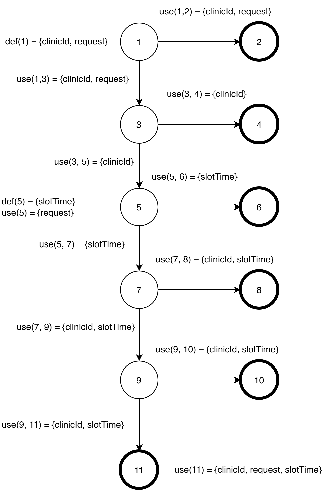

# Graph Coverage

---
### Edge Pair Coverage
**Method:** `AppointmentService.cancelAppointmentForOwner(Long userId, Long appointmentId)`

**Graph:**

  

**Nodes:**
1. `if (userId == null || appointmentId == null)`
2. `throw new RuntimeException("User and appointment are required");`
3. `if (appointment == null)`
4. `throw new RuntimeException("Appointment not found");`
5. `if (appointment.getResponsibleOwner() == null || ... || !appointment.getResponsibleOwner().getUserId().equals(userId))`
6. `throw new RuntimeException("You can only cancel your own appointments");`
7. `if (!appointment.getDateTime().isAfter(LocalDateTime.now()))`
8. `throw new RuntimeException("Only future appointments can be cancelled");`
9. `if ("CANCELLED".equals(appointment.getStatus()) || "CANCELED".equals(appointment.getStatus()))`
10. `throw new RuntimeException("Appointment is already cancelled");`
11. `if ("DONE".equals(appointment.getStatus()) || "NO_SHOW".equals(appointment.getStatus()))`
12. `throw new RuntimeException("This appointment can no longer be cancelled");`
13. `appointment.setStatus("CANCELLED"); appointmentRepository.save(appointment); notifyClinicAboutCancellation(saved); return mapToOwnerDTO(saved);`

**Edges:**
(1,2), (1,3), (3,4), (3,5), (5,6), (5,7), (7,8), (7,9), (9,10), (9,11), (11,12), (11,13)

**All Edge Pairs:**
[1, 3, 4], [1, 3, 5], [3, 5, 6], [3, 5, 7], [5, 7, 8], [5, 7, 9], [7, 9, 10], [7, 9, 11], [9, 11, 12], [9, 11, 13]

**Test Paths:**

| Test Path                | Covers Edge-Pairs       |
|:-------------------------|:------------------------|
| [1, 2]                   | [1, 2]                  |
| [1, 3, 4]                | [1, 3, 4]               |
| [1, 3, 5, 6]             | [1, 3, 5], [3, 5, 6]    |
| [1, 3, 5, 7, 8]          | [3, 5, 7], [5, 7, 8]    |
| [1, 3, 5, 7, 9, 10]      | [5, 7, 9], [7, 9, 10]   |
| [1, 3, 5, 7, 9, 11, 12]  | [7, 9, 11], [9, 11, 12] |
| [1, 3, 5, 7, 9, 11, 13]  | [9, 11, 13]             |

---

### Prime Path Coverage
**Method:** `AppointmentService.markAppointmentNoShowForClinicUser(Long userId, Long appointmentId)`

**Graph:**

  

*(Note: `resolveClinicIdForUser` is assumed to pass as setup logic. The graph begins at the appointment fetch)*.

**Nodes:**
1. `if (appointment == null)` 
2. `throw new RuntimeException("Appointment not found");`
3. `if (!clinicId.equals(appointment.getClinicId()))`
4. `throw new RuntimeException("You can only update appointments for your own clinic");`
5. `if (!"CONFIRMED".equals(appointment.getStatus()) && !"DONE".equals(appointment.getStatus()))`
6. `throw new RuntimeException("Only confirmed or done appointments can be marked as no-show");`
7. `if (appointment.getDateTime().isAfter(LocalDateTime.now()))`
8. `throw new RuntimeException("An appointment can be marked as no-show only after its scheduled time");`
9. `appointment.setStatus("NO_SHOW"); return mapToClinicDTO(appointmentRepository.save(appointment));`

**Edges:**
(1,2), (1,3), (3,4), (3,5), (5,6), (5,7), (7,8), (7,9)

| Prime Path      | Description / Constraints                                       |
|:----------------|:----------------------------------------------------------------|
| [1, 2]          | Appointment not found in database                               |
| [1, 3, 4]       | Appointment belongs to a different clinic                       |
| [1, 3, 5, 6]    | Status is neither `CONFIRMED` nor `DONE`                        |
| [1, 3, 5, 7, 8] | Status is valid (`CONFIRMED`/`DONE`), but time is in the future |
| [1, 3, 5, 7, 9] | Status is valid, and time is in the past (SUCCESS)              |
---

### All-DU-Paths Coverage
**Method:** `AppointmentService.createUnavailableSlot(Long clinicId, CreateUnavailableSlotRequest request)`

**Graph:**

  

**Nodes:**
1. `if (clinicId == null || request.getDateTime() == null)`
2. `throw new RuntimeException("Clinic and date/time are required");`
3. `if (!vetClinicRepository.existsById(clinicId))`
4. `throw new RuntimeException("Vet clinic not found");`
5. `LocalDateTime slotTime = LocalDateTime.parse(request.getDateTime()); if (!isValidWorkingSlot(slotTime))`
6. `throw new RuntimeException("Unavailable slot must be a future 30-minute slot between 09:00 and 17:00");`
7. `if (appointmentRepository.existsByClinicIdAndDateTimeAndStatusNotIn(clinicId, slotTime, NON_BLOCKING_STATUSES))`
8. `throw new RuntimeException("Cannot block a slot that already has an appointment");`
9. `if (unavailableSlotRepository.existsByClinicIdAndDateTime(clinicId, slotTime))`
10. `throw new RuntimeException("This slot is already marked unavailable");`
11. `ClinicUnavailableSlot saved = unavailableSlotRepository.save(new ClinicUnavailableSlot(clinicId, slotTime, request.getReason())); return mapToUnavailableSlotDTO(saved);`

**Edges:**
(1,2), (1,3), (3,4), (3,5), (5,6), (5,7), (7,8), (7,9), (9,10), (9,11)

**Data Flow Annotations:**
*   **Variable `clinicId`:**
    *   $def(1) = \{clinicId\}$
    *   $use(1,2) = use(1,3) = \{clinicId\}$
    *   $use(3,4) = use(3,5) = \{clinicId\}$
    *   $use(7,8) = use(7,9) = \{clinicId\}$
    *   $use(9,10) = use(9,11) = \{clinicId\}$
    *   $use(11) = \{clinicId\}$
*   **Variable `request`:**
    *   $def(1) = \{request\}$
    *   $use(1,2) = use(1,3) = \{request\}$
    *   $use(5) = \{request\}$
    *   $use(11) = \{request\}$
*   **Variable `slotTime`:**
    *   $def(5) = \{slotTime\}$
    *   $use(5,6) = use(5,7) = \{slotTime\}$
    *   $use(7,8) = use(7,9) = \{slotTime\}$
    *   $use(9,10) = use(9,11) = \{slotTime\}$
    *   $use(11) = \{slotTime\}$

---

### All-DU-Paths Set

| Variable  | Du-pairs                                                                                                  |
|:----------|:----------------------------------------------------------------------------------------------------------|
| clinicId  | (1, (1,2)), (1, (1,3)), (1, (3,4)), (1, (3,5)), (1, (7,8)), (1, (7,9)), (1, (9,10)), (1, (9,11)), (1, 11) |
| request   | (1, (1,2)), (1, (1,3)), (1, 5), (1, 11)                                                                   |
| slotTime  | (5, (5,6)), (5, (5,7)), (5, (7,8)), (5, (7,9)), (5, (9,10)), (5, (9,11)), (5, 11)                         |

| Variable  | Du-path set     | Du-paths            |
|:----------|:----------------|:--------------------|
| clinicId  | $du(1, (1,2))$  | [1, 2]              |
|           | $du(1, (1,3))$  | [1, 3]              |
|           | $du(1, (3,4))$  | [1, 3, 4]           |
|           | $du(1, (3,5))$  | [1, 3, 5]           |
|           | $du(1, (7,8))$  | [1, 3, 5, 7, 8]     |
|           | $du(1, (7,9))$  | [1, 3, 5, 7, 9]     |
|           | $du(1, (9,10))$ | [1, 3, 5, 7, 9, 10] |
|           | $du(1, (9,11))$ | [1, 3, 5, 7, 9, 11] |
|           | $du(1, 11)$     | [1, 3, 5, 7, 9, 11] |
| request   | $du(1, (1,2))$  | [1, 2]              |
|           | $du(1, (1,3))$  | [1, 3]              |
|           | $du(1, 5)$      | [1, 3, 5]           |
|           | $du(1, 11)$     | [1, 3, 5, 7, 9, 11] |
| slotTime  | $du(5, (5,6))$  | [1, 3, 5, 6]        |
|           | $du(5, (5,7))$  | [1, 3, 5, 7]        |
|           | $du(5, (7,8))$  | [1, 3, 5, 7, 8]     |
|           | $du(5, (7,9))$  | [1, 3, 5, 7, 9]     |
|           | $du(5, (9,10))$ | [1, 3, 5, 7, 9, 10] |
|           | $du(5, (9,11))$ | [1, 3, 5, 7, 9, 11] |
|           | $du(5, 11)$     | [1, 3, 5, 7, 9, 11] |

**Test Paths:**
*   [1, 2]
*   [1, 3, 4]
*   [1, 3, 5, 6]
*   [1, 3, 5, 7, 8]
*   [1, 3, 5, 7, 9, 10]
*   [1, 3, 5, 7, 9, 11]